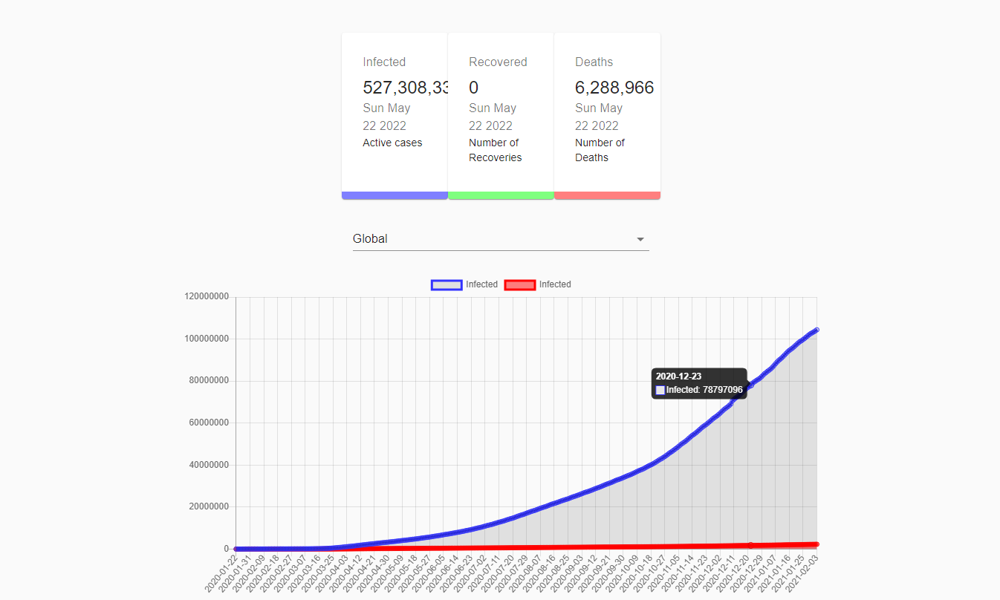
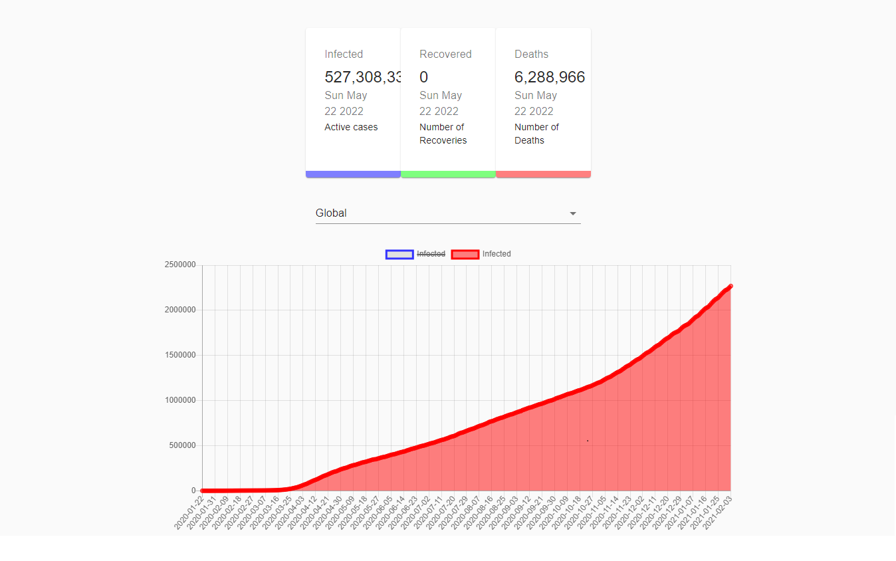

# Covitrack

Covitrack web application to track coronavirus cases by country and visualize them.

I have developed covitrack completely in react and javascript

On dashboard users can visualize and browse active cases and current deaths by dates.

One can select the details the wish to see

## Images

1. Total Infected

2. Total Deaths

